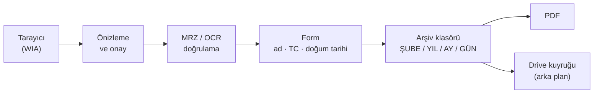

<div align="center">

# Docvera

**Dövizciler için müşteri evrak tarama ve arşivleme**

`Kimliği tara` → `MRZ'den doğrula` → `Klasörle` → `PDF üret` → `Drive'a yükle`

[](https://github.com/tbsagdic/docvera/releases)


</div>

---

Dövizciye gelen müşterinin **ad soyad, TC kimlik no, doğum tarihi** bilgisini alır,
**kimliğini tarar**, tarihe ve şubeye göre otomatik klasörler, **PDF** üretir ve
**Google Drive'a** yükler. Kasiyerin işi tarama tuşuna basmaktan ibarettir.

### Öne çıkanlar

| | |
|---|---|
| **Yazmadan doldurur** | Kimliğin arka yüzündeki MRZ okunur; TC ve doğum tarihi **kontrol hanesiyle** doğrulanır |
| **Asla yanlış yazmaz** | Doğrulanamayan alan boş bırakılır ve kasiyerden istenir — tahmin yürütülmez |
| **Cihazda kalır** | OCR tamamen yerel çalışır; kimlik görüntüsü hiçbir bulut servisine gitmez |
| **Çevrimdışı çalışır** | İnternet yoksa arşiv yine yazılır, Drive yüklemeleri kuyruğa alınır |
| **Düzeni bozmaz** | Klasör ağacı elle tutulan mevcut arşivle birebir aynıdır |
| **Kurulum istemez** | Tek klasör `.exe`; hedef makinede Python gerekmez |
| **Eksiğini kendi kurar** | Tesseract ve Türkçe dil paketi eksikse tek düğmeyle indirilip kurulur |

### Akış



---

## Klasör düzeni

Klasör düzeni elle tutulan mevcut arşivle birebir aynıdır:

```
<KÖK>\<ŞUBE>\2026\01.2026\02.01.26\ALİ ÖZDEMİR 8901\
        ├── 01.jpg
        ├── 02.jpg
        ├── ALİ ÖZDEMİR_02.01.2026.pdf
        └── meta.json
```

- `8901` = TC'nin son 4 hanesi. Aynı gün aynı isimli iki farklı müşteri karışmaz.
- **Aynı müşteri aynı gün tekrar gelirse** yeni klasör açılmaz; sayfalar `03.jpg`,
  `04.jpg` diye devam eder ve PDF yeniden üretilir.
- `<ŞUBE>` seviyesi yalnızca ayarlarda şube adı doluysa oluşur.

---

## Kurulum

### Gereksinimler

- Windows 10/11
- Python 3.10 – 3.14 (geliştirme için; son kullanıcıya `.exe` verilir)
- WIA uyumlu bir tarayıcı (Windows'un tanıdığı hemen her tarayıcı/MFP)
- Tesseract OCR + Türkçe dil paketi — **uygulama gerekirse kendisi kurar**, elle indirmeye gerek yok

### Geliştirme ortamı

```bat
python -m venv .venv
.venv\Scripts\python.exe -m pip install -r requirements-dev.txt
.venv\Scripts\python.exe -m app
```

### Tarayıcıyı sınama

Uygulamayı kurmadan önce donanımı doğrulayın:

```bat
.venv\Scripts\python.exe tools\scanner_probe.py --list          :: cihazları listele
.venv\Scripts\python.exe tools\scanner_probe.py --props         :: WIA özelliklerini dök
.venv\Scripts\python.exe tools\scanner_probe.py --scan test.jpg :: gerçek tarama al
```

`--scan` çalışıyorsa uygulama da çalışır.

---

## Otomatik kimlik okuma (MRZ)

Kimlik tarandığında **TC, ad soyad ve doğum tarihi** forma otomatik yazılır.
Bunun için genel OCR değil, kimliğin **arka yüzündeki MRZ** (makine okunabilir
alan) okunur:

```
I<TURA123456784<10000000146<<<
8503057M3001019TUR<<<<<<<<<<<2
OZDEMIR<<ALI<<<<<<<<<<<<<<<<<<
```

> Buradaki MRZ gerçek bir kimliğe ait değildir: kontrol haneleri hesaplanarak
> üretilmiş sentetik bir örnektir. Depoda hiçbir yerde gerçek kimlik verisi tutulmaz.

MRZ yalnızca `A-Z`, `0-9` ve `<` içerir **ve içinde kontrol haneleri vardır**.
Bu yüzden okumanın doğruluğu tahmin edilmez, **hesaplanır**.

### İki okuma yolu

**1) Kimlik kartı — MRZ (kesin)**

MRZ kontrol hanelerinden geçen okuma matematiksel olarak doğrulanmıştır.

| Alan | Doğrulama | Sonuç |
|---|---|---|
| **TC Kimlik No** | MRZ bileşik kontrol hanesi **+** TC'nin kendi algoritması | Doğrulanırsa yazılır, yoksa boş kalır |
| **Doğum tarihi** | MRZ kontrol hanesi | Doğrulanırsa yazılır, yoksa boş kalır |
| **Ad soyad** | **Yok** — TD1 standardında ad satırını koruyan kontrol hanesi bulunmaz | Yazılır ama **sarı işaretlenir**, kasiyer karşılaştırır |

**2) Sürücü belgesi ve diğer belgeler — metin (orta güven)**

Sürücü belgesinde MRZ **yoktur**; TC `4d` alanında yazar. Bu durumda sayfadaki
11 haneli sayılar taranır ve doğrulayıcı olarak **TC'nin kendi algoritması**
kullanılır. Rastgele bir sayının bu algoritmadan geçme olasılığı 1/100
olduğundan tek başına yeterli sayılmaz; şu ek kanıtlardan **en az biri** aranır:

- Numaranın yanında `4d`, `TC Kimlik No`, `TCKN` gibi bir **etiket** bulunması
- Aynı numaranın sayfada **birden fazla yerde** geçmesi (örneğin hem sürücü
  belgesinde hem döviz belgesinde)

Hiçbiri yoksa, ya da algoritmadan geçen **iki farklı** aday varsa, alan boş
bırakılır. Doğum tarihi de yalnızca makul yaş veren **tek** bir tarih bulunursa
yazılır (veriliş/geçerlilik tarihleri elenir).

Bu yol `orta` güvenle raporlanır ve ekranda öyle gösterilir.

Bu ayrım bilinçlidir. Uygulama **asla yanlış veri yazmaz**; okuyamadığında
alanı boş bırakıp kasiyerden ister. "Hatasız" sözü buna dayanır: doğrulanmamış
hiçbir değer forma geçmez.

Ek korumalar:

- Kasiyerin elle yazdığı bir değer **asla sessizce değiştirilmez**. Kimlikten
  okunan farklıysa uyarı çıkar, karar kasiyerindir.
- Sayfada ne MRZ ne de yeterli kanıtlı bir TC varsa hiçbir şey doldurulmaz.
- Doğru okunmuş MRZ satırları, sayfadaki alakasız bir metinle eşleşip forma
  çöp isim yazamaz (ad satırı ayrıca şekil denetiminden geçer).
- MRZ'deki ad ASCII'dir (`OZDEMIR`). Kartın ön yüzü Türkçe OCR ile okunup
  `ÖZDEMİR` yazımı geri kazanılmaya çalışılır; yalnızca ASCII'ye
  indirgendiğinde MRZ ile birebir aynı olan sonuç kabul edilir.

### Tesseract kurulumu — uygulama kendisi yapar

OCR **tamamen bu bilgisayarda** çalışır; kimlik görüntüsü hiçbir bulut servisine
gönderilmez. Bu, KVKK açısından bilinçli bir tercihtir.

Kasiyerin kurulumla uğraşması gerekmez. Docvera açılışta eksik bileşenleri kendisi
tespit eder ve tek düğmelik bir pencere gösterir:

```
Eksik bileşenler
─────────────────────────────────────────────
Tesseract OCR
  Kimlikten TC, ad soyad ve doğum tarihi otomatik
  okunamaz; kasiyer her alanı elle yazmak zorunda kalır.

Türkçe dil paketi
  İsimlerdeki Ş, Ğ, İ, Ö, Ü, Ç harfleri geri kazanılamaz.

                            [ Sonra ]  [ Kur ]
```

**Kur**'a basıldığında:

| Bileşen | Nasıl kurulur | Yönetici izni |
|---|---|---|
| Tesseract OCR (~50 MB) | Önce **winget** (`UB-Mannheim.TesseractOCR`) denenir — indirdiği dosyanın SHA-256 özetini Microsoft'un deposundaki paket özetiyle kendisi doğrular. winget yoksa **GitHub Releases**'teki en son sürüm sorulup indirilir; sürüm numarası koda gömülü değildir. | Windows bir kez sorar, "Evet" demek yeterli |
| Türkçe + İngilizce dil paketi (~8 MB) | `tessdata_fast` deposundan `%LOCALAPPDATA%\Docvera\tessdata\` klasörüne indirilir ve Tesseract'a `--tessdata-dir` ile gösterilir | Gerekmez |

Dil paketlerinin Program Files yerine kullanıcı klasörüne inmesi bilinçlidir:
böylece dil eklemek için yönetici yetkisi gerekmez.

Güvenlik tarafında indirme adresi **HTTPS ve beyaz listedeki sunucularla** sınırlıdır;
indirilen kurulum dosyası çalıştırılmadan önce boyut ve PE imzası yönünden denetlenir.

Aynı pencere **Ayarlar → Otomatik Kimlik Okuma → Eksikleri kur** ile istendiği zaman
açılabilir. *Bu uyarıyı bir daha gösterme* işaretlenirse açılışta sorulmaz; ayar
`kurulum_sorma` alanında tutulur.

Tesseract kurulu değilse uygulama yine normal çalışır, yalnızca otomatik doldurma
devre dışı kalır.

> **İpucu:** MRZ'nin okunabilmesi için kimliğin **arka yüzünü** en az 300 DPI
> ile, düz ve tam olarak tarayın. Ters (180°) tarama otomatik düzeltilir.

---

## Google Drive kurulumu

Dosyalar Drive'a iki yoldan gidebilir. Sonuç aynıdır; kurulum zorluğu ve
davranış farkı vardır:

| | **Drive masaüstü uygulaması** | **Doğrudan yükleme (API)** |
|---|---|---|
| Kurulum | Uygulamayı kur, hesabınla giriş yap (~3 dk) | Google Cloud projesi + OAuth dosyası (~5 dk, teknik) |
| Yükleyen | Google'ın kendi uygulaması | Docvera'nın kendi kuyruğu |
| Silinen dosya | Drive'dan da silinir — **ayna** | Bulut kopyası kalır — **tek yönlü** |
| Yükleme durumu | Drive'ın kendi simgesinden | Docvera durum çubuğunda, yeniden deneme ile |
| Çok şubeli kurulum | Her makine diğerlerinin dosyalarını da indirir | Yalnızca yükleme yapılır |

Tek tarama istasyonunda **Drive masaüstü uygulaması** yeter ve hiçbir teknik
adım gerektirmez. Kasiyerin dosya silebildiği ya da bulutta bozulmayacak bir
kopya istenen kurulumlarda **API** yolu seçilmelidir: eşitleme yedek değildir.

### Drive masaüstü uygulamasıyla eşitleme

1. [Drive masaüstü uygulamasını](https://www.google.com/drive/download/) kurup
   Google hesabınızla giriş yapın.
2. Ayarlar → **Google Drive** → **Drive klasörünü bul ve kur**.

Program eşitlenen klasörü kendisi bulur (ev dizini ve sanal sürücü harfleri
taranır; klasör adının İngilizce mi Türkçe mi olduğu fark etmez), arşiv kökünü
oradaki `DOCVERA ARSIV` klasörüne alır ve kendi yüklemesini kapatır — aynı
dosyalar iki kez yüklenmesin diye. Klasör bulunamazsa indirme sayfası açılır
veya klasör elle gösterilebilir.

Bu yol seçildiğinde durum çubuğu `Drive: klasör eşitlemesi açık` yazar; yükleme
ilerlemesi Drive uygulamasının kendi simgesinden izlenir.

### Doğrudan yükleme (API)

Uygulama Drive'a **`drive.file`** kapsamıyla bağlanır: yalnızca kendi oluşturduğu
dosyalara erişir, kullanıcının Drive'ındaki başka hiçbir şeye dokunamaz.

Bunun iki önemli sonucu var:

> **1. Mevcut bir Drive klasörüne yazılamaz.**
> Kök klasör (`DOCVERA ARSIV`) ilk bağlantıda **uygulama tarafından oluşturulur**.
> Eski arşivi Drive'a taşıyacaksanız, uygulama klasörü oluşturduktan sonra
> dosyaları elle o klasörün içine taşıyın.

> **2. OAuth uygulaması "Üretim" durumuna alınmalıdır.**
> Google Cloud Console'da uygulama "Test" durumundayken yalnızca **Test
> kullanıcıları** listesindeki adresler giriş yapabilir; listede olmayan hesap
> yetkilendirme ekranında **"Erişim engellendi — Hata 403: access_denied"**
> alır. Test durumu geçilse bile yenileme jetonu **7 günde bir düşer** ve
> kasiyer her hafta yeniden giriş yapmak zorunda kalır.
> `drive.file` hassas kapsam olmadığı için Üretim'e almak Google doğrulama
> sürecini gerektirmez; **Hedef kitle** (Audience) sayfasındaki *Uygulamayı
> yayınla* düğmesi yeter.

### Her kurulum kendi Google projesini kullanır

Docvera'ya **gömülü bir OAuth istemcisi dağıtılmaz.** Kullanıcı Ayarlar → Google
Drive → **Dosya seç** ile kendi Google projesinin dosyasını yükler.

Bu bilinçli bir karardır. Tek bir paylaşılan proje üzerinden gidilseydi:

- Tüm kurulumlar aynı API kotasını paylaşırdı
- Biri kötüye kullandığında Google projeyi askıya alır, **herkesin** yüklemesi
  aynı anda dururdu
- Google nezdinde sorumluluk tek bir kişide toplanırdı

Kendi projesini kuran kullanıcının kotası, sorumluluğu ve riski kendisinde kalır.

> **Ne kadar sürer:** ~5 dakika, bilgisayar başına bir kez.
> Ayarlar → Google Drive → **Nasıl yapılır?** düğmesi adım adım anlatan bir
> pencere açar; her adımın Google sayfasını tek tuşla açar ve adımlar panoya
> kopyalanabilir.

Bağlantı kurulmadan **Google Drive'a bağlan** düğmesi kapalı durur ve neden
kapalı olduğunu söyler — basıldıktan sonra hata penceresiyle öğrenilmez.

<details>
<summary><b>Gömülü istemciyle dağıtım</b> (özel durum)</summary>

Kapalı bir müşteri grubuna dağıtım yapılıyorsa proje köküne `credentials.json`
konabilir; `paketle.bat` onu pakete gömer ve kullanıcı hiçbir kurulum yapmadan
tek tuşla bağlanır. Ayarlar penceresi bu durumda ek bir seçenek gösterir.

Masaüstü uygulamalarında istemci gizli anahtarı zaten gizli tutulamaz; Google'ın
`installed app` akışı buna göre tasarlanmıştır — güvenlik, kullanıcının
tarayıcıda verdiği onaya dayanır, anahtarın gizliliğine değil. Yine de yukarıdaki
ortak kota ve ortak askıya alınma riskleri geçerlidir.

</details>

### Seçilen dosya doğrulanır

Kullanıcı indirdiği JSON dosyasını **Dosya seç** ile gösterir. Dosyayı yeniden
adlandırmasına veya bir klasöre kopyalamasına gerek yoktur — program gerekeni
kendisi yapar ve **dosyanın doğru türde olduğunu kontrol eder**:

| Durum | Sonuç |
|---|---|
| Masaüstü istemcisi | Kabul edilir |
| **Web** uygulaması istemcisi | Reddedilir, "Masaüstü uygulaması seçmelisiniz" denir |
| Bozuk / alakasız JSON | Reddedilir, nedeni söylenir |
| `client_secret` eksik | Reddedilir, hangi alanın eksik olduğu söylenir |

Web istemcisi seçmek Google Cloud'da en sık yapılan hatadır ve normalde hatası
ancak yetkilendirme ekranında, anlaşılmaz bir mesajla ortaya çıkar. Burada dosya
seçilir seçilmez yakalanır.

**Kaldır** düğmesi kurulu projeyi kaldırır.

Kendi projeye geçildiğinde veya kaldırıldığında eski yetkilendirme jetonu
silinir — başka bir projeye ait jeton geçersizdir.

---

Yenileme jetonu Windows **DPAPI** ile şifrelenip `token.bin` olarak saklanır —
düz metin jeton diskte durmaz ve yalnızca aynı Windows kullanıcısı aynı makinede
çözebilir.

---

## Kullanım

Olağan akış **taramayla başlar** — müşteri bilgisi önce girilmek zorunda değildir:

1. **TARA (F5)** → kimliği tara → önizlemede **Onayla / Onayla ve Tekrar Tara /
   Reddet**. Reddedilen sayfa arşive hiç yazılmaz.
2. Sayfa onaylanır onaylanmaz kimlik arka planda okunur; MRZ bulunursa **TC, ad
   soyad ve doğum tarihi forma kendiliğinden yazılır** (bkz. *Otomatik kimlik
   okuma*). Ad soyad kontrol edilmek üzere sarı işaretlenir.
3. Okunamayan veya eksik kalan alanlar elle tamamlanır. TC resmî algoritmayla
   anında doğrulanır. Müşteri daha önce geldiyse alanlar geçmişten dolar ve
   önceki ziyaret tarihleri gösterilir.
4. Gerekirse başka evraklar da taranır; sayfa şeridinden döndürülebilir veya
   silinebilir.
5. **KAYDET (Ctrl+S)** → klasör açılır, JPG'ler yazılır, PDF birleştirilir,
   `meta.json` ve veritabanı güncellenir, dosyalar Drive kuyruğuna alınır.

**TARA** yalnızca tarayıcı seçilmiş olmasını ister. Müşteri bilgisi şartı
**KAYDET**'tedir; eksik alan varsa düğmenin üstünde ne girilmesi gerektiği yazar.

### Dosyadan ekleme (tarayıcısız)

Evrak WhatsApp'tan geldiyse, başka bir bilgisayarda tarandıysa veya tarayıcı
arızalıysa dosyadan eklenebilir. Üç yol var:

- **Dosyadan Ekle** düğmesi
- **Ctrl+O**
- Dosyaları doğrudan **pencereye sürükleyip bırakma**

Desteklenen türler: **PDF** ve görüntüler (JPG, PNG, TIFF, BMP, WEBP, GIF).
Birden fazla dosya aynı anda seçilebilir.

- PDF sayfaları seçili çözünürlükte görüntüye çevrilir (harici program
  gerekmez), her sayfa ayrı bir sayfa olur.
- Telefondan gelen görüntülerde EXIF yönlendirmesi uygulanır — önizlemede düz
  görünüp arşivde yan kaydedilme sorunu olmaz.
- Tek sayfa eklenirse önizleme açılır; çok sayfa doğrudan şeride eklenir,
  istemediğinizi şeritten silersiniz.
- 5'ten fazla sayfa varsa önce onay sorulur; dosya başına en fazla 50 sayfa.

Eklenen sayfalar taramadan gelenlerle **tamamen aynı** işlenir: kimlik okuma,
döndürme, PDF birleştirme, Drive yükleme. Kimlik birinci sayfada değilse sonraki
sayfalarda da aranır.

### Kısayollar

| Tuş | İşlev |
|---|---|
| `F5` | Tara |
| `Ctrl+S` | Kaydet |
| `Ctrl+O` | Dosyadan ekle (PDF/görüntü) |
| `Ctrl+F` | Geçmiş kayıtlarda ara |
| `Delete` | Seçili sayfayı sil |
| `Enter` (önizlemede) | Onayla |

### Çevrimdışı çalışma

İnternet yokken kayıt alınmaya devam edilir. Dosyalar SQLite'taki kuyrukta bekler,
bağlantı gelince arka planda yüklenir. Uygulama kapanıp açılsa bile kuyruk
kaybolmaz. Durum çubuğu ne olduğunu gösterir:

- `Drive: tümü yüklendi`
- `Drive: 3 dosya yükleniyor`
- `Drive: 2 dosya yüklenemedi` → **Araçlar → Yüklenemeyen dosyaları yeniden dene**

Yeniden deneme aralığı üstel olarak artar: 5sn → 30sn → 2dk → 10dk → 1sa.

---

## Çok şubeli kurulum

Her şube kendi bilgisayarında kendi yerel veritabanıyla bağımsız çalışır.
Ayarlardan **şube kodu** ve **şube adı** girilir; klasör ağacının en üstüne şube
seviyesi eklenir ve tüm kayıtlarda `sube_kodu` tutulur. Şubeler Drive üzerinde
aynı kök klasör altında birleşir.

---

## Veri güvenliği (KVKK / MASAK)

- Kimlik görüntüsü ve TC kişisel veridir. MASAK 5549 gereği kimlik tespit
  belgeleri **8 yıl** saklanmalıdır — bu yüzden uygulamada kayıt silme yoktur.
- Klasör adında TC'nin yalnızca **son 4 hanesi** görünür; tam TC `meta.json` ve
  veritabanında tutulur.
- Her kayıt işlemi **denetim kaydına** yazılır: hangi Windows kullanıcısı, ne
  zaman, hangi müşteri.
- Drive erişimi `drive.file` ile en dar kapsamda tutulur.
- **Öneri:** Arşiv kök klasörüne NTFS izinleriyle yalnızca yetkili Windows
  hesaplarının erişmesini sağlayın; Drive kök klasörünü sınırlı sayıda hesapla
  paylaşın.

---

## Dağıtım (.exe)

```bat
.venv\Scripts\python.exe -m PyInstaller --onedir --noconfirm --windowed ^
    --name Docvera --paths . app\__main__.py
```

`dist\Docvera\` klasörü olduğu gibi hedef makineye kopyalanabilir; Python kurulumu
gerektirmez. (Python 3.14 + PySide6 + PyInstaller birleşimi bu projede doğrulandı.)

Son kullanıcıya bu klasör **elden verilmez**: [`tools/docvera.iss`](tools/docvera.iss)
ile bir **kurulum sihirbazı** (Inno Setup) derlenir — `Docvera-<sürüm>-kurulum.exe`.
Sihirbaz Başlat menüsüne (isteğe bağlı masaüstüne) kısayol koyar, "Programlar ve
Özellikler" altında kaldırma girdisi oluşturur ve kurulum bitince uygulamayı açar.

Kurulum yeri `%LOCALAPPDATA%\Programs\Docvera` ve **yönetici şifresi istenmez**.
Bu bilinçli bir tercih: uygulama kendini güncellerken kendi klasörünün üzerine
yazabilmeli. Program Files'a kurulsaydı her güncelleme UAC isterdi ve şube
bilgisayarındaki kasiyer yönetici şifresini bilmediği için güncelleme hiç
yapılamazdı.

`--onefile` yerine `--onedir` tercih edilir: tek dosyalı paket her açılışta kendini
geçici klasöre açtığı için PySide6 ile başlangıç belirgin şekilde yavaşlar.

---

## Sürümleme

Sürüm numarası elle güncellenmez; **git commit sayısına** bağlıdır:

```
1.0.<commit sayısı>        17. commit  ->  1.0.17
```

`.githooks/pre-commit`, her commit'ten önce [`tools/surum_yaz.py`](tools/surum_yaz.py)
çalıştırıp `app/surum.py` dosyasını o commit'in sıra numarasıyla üretir ve commit'e
dahil eder. Böylece paketlenen `.exe`, git kurulu olmayan bir makinede de kendi
sürümünü bilir; `meta.json` içindeki `uygulama_surumu` alanı da kaydı hangi sürümün
yazdığını kesin gösterir.

Depoyu yeni klonlayan makinede kancayı bir kez etkinleştirin:

```bat
git config core.hooksPath .githooks
```

Her revizyon aynı numarayla etiketlenir ve
[Releases](https://github.com/tbsagdic/docvera/releases) altında yayımlanır:
`v1.0.<commit sayısı>`.

---

## Güncelleme

İlk kurulum `Docvera-<sürüm>-kurulum.exe` ile yapılır (bkz. [Dağıtım](#dağıtım-exe));
sonrasında uygulama kendini günceller — kullanıcının bir daha dosya indirmesi,
klasör kopyalaması ya da kurulum çalıştırması gerekmez.

### Kullanıcı tarafı

| Nerede | Ne yapar |
|---|---|
| **Yardım > Güncellemeleri denetle** | Hemen sorgular, sonucu durum çubuğunda söyler |
| **Ayarlar > Güncelleme** | Otomatik denetimi açar/kapatır, atlanan sürümü geri alır |
| Otomatik denetim | Açılıştan 5 saniye sonra, **günde en fazla bir kez** sorgular |

Yeni sürüm bulununca sürüm notlarıyla birlikte bir pencere açılır: **Şimdi kur**,
**Daha sonra** ya da **Bu sürümü atla**. Atlanan sürüm bir daha hatırlatılmaz;
sonraki sürümler yine bildirilir.

Kurulum sırasında indirme yüzdesi gösterilir, uygulama kapanır ve yeni sürümle
kendiliğinden açılır. Ayarlar, arşiv, veritabanı ve Drive bağlantısı `%APPDATA%`
altında durduğu için güncellemeden etkilenmez.

### Nasıl çalışıyor

1. `https://api.github.com/repos/tbsagdic/docvera/releases/latest` sorgulanır
   (anonim; hiçbir kullanıcı bilgisi gönderilmez).
2. Etiket **sayısal** karşılaştırılır: `1.0.10 > 1.0.9`. Ayrıştırılamayan bir
   etiket asla güncelleme sayılmaz.
3. Paket indirilir; **boyutu ve SHA-256 özeti** yayın notundaki (ya da GitHub
   API'nin `digest` alanındaki) değerle karşılaştırılır. Tutmazsa kurulum
   yapılmaz, indirilen dosya silinir.
4. Paket, çalışan uygulamanın **yanına** açılır ve uygulamadan bağımsız bir cmd
   betiği başlatılır — çalışan `.exe` kendi klasörünün üzerine yazamaz. Betik
   kendi konsol penceresinde çalışır ("Docvera guncelleniyor"): hem kullanıcı
   ne olduğunu görüp uygulamayı yeniden açmaya çalışmaz, hem de konsolsuz
   başlatılan `cmd` ilk çıktı satırında ölmez.
5. Betik uygulamanın kapanmasını bekler, sonra `move` ile eski klasörü yedeğe,
   yeni klasörü yerine alır. `move` aynı diskte anlık bir işlemdir: yarım kalmış
   bir kopyalama bozuk kurulum bırakmaz. Yeni klasör yerine konamazsa **eski
   sürüm geri alınır**.
6. Sonuç `%APPDATA%\Docvera\guncelleme_sonuc.txt` dosyasına yazılır; uygulama
   açılışta bunu okuyup kullanıcıya söyler ve dosyayı siler. Sessizce başarısız
   olan kurulum en kötü durumdur — kullanıcı güncellediğini sanıp eski sürümde
   çalışmaya devam eder. Bu yüzden ikinci bir savunma var: sonuç dosyası yokken
   kurulum betiği kalıntısı duruyorsa betik hiç çalışamamış demektir (güvenlik
   yazılımı, kapatılan oturum...); uygulama bunu da bildirir ve yüzlerce
   megabaytlık açılmış paket kalıntısını temizler.

Kurulum günlüğü: `%APPDATA%\Docvera\guncelleme.log`.

**Otomatik kurulumun yapılamadığı durumlar** kullanıcıya açıkça söylenir ve yayın
sayfasına yönlendirilir: kaynak koddan çalıştırma, uygulama klasörünün üst
dizinine yazma izni olmaması (izin, indirmeden **önce** denetlenir) ve
kaydedilmemiş taranmış sayfa bulunması (kurulum uygulamayı kapatacağı için).

### Sürüm yayımlama

```bat
paketle.bat          rem dist\Docvera\ üretir
yayinla.bat          rem zipler, SHA-256 hesaplar, GitHub'a yayımlar
```

[`tools/yayinla.py`](tools/yayinla.py) her yayında **iki dosya** üretir:

| Dosya | Kim indirir |
|---|---|
| `Docvera-<sürüm>-kurulum.exe` | Son kullanıcı — ilk kurulum (Inno Setup sihirbazı) |
| `Docvera-<sürüm>-win64.zip` | Uygulamanın kendisi — güncelleme paketi |

Güncelleme neden zip? Kurulum sihirbazı çalıştırılırken pencere açar ve etkileşim
bekler; güncelleme ise sessiz olmalı. Zip, `move` ile yerine geçtiği için hızlı,
etkileşimsiz ve geri alınabilir. Yayın biçimi:

- etiket `v<sürüm>`
- zip'in kökünde tek bir `Docvera\` klasörü
- yayın notlarındaki **ilk** `SHA-256:` satırı zip'e aittir (güncelleme bunu okur)

Inno Setup kurulu değilse sihirbaz üretilmez, yayın yalnızca zip ile çıkar ve
betik bunu bildirir:

```bat
winget install --id JRSoftware.InnoSetup
```

> Güncelleme, kurulumla gelen `unins000.exe` / `unins000.dat` dosyalarını yeni
> klasöre taşır. Aksi halde güncellenen bir kurulumun "Programlar ve Özellikler"
> girdisi çalışmaz hale gelirdi.

Paket `app/surum.py`'den eskiyse betik durur; böylece yanlış sürüm numarasıyla
etiketlenmiş bir paket yayımlanamaz. `--sadece-zip` yayımlamadan paketler,
`--taslak` taslak yayın açar. GitHub CLI kurulu değilse elle yayımlama adımları
yazdırılır.

> Yayına `.zip` eki koymayı unutursanız kullanıcılar "kurulabilir paket
> eklenmemiş" uyarısıyla yayın sayfasına yönlendirilir; sessiz bir hata oluşmaz.

---

## Dosya konumları

| Ne | Nerede |
|---|---|
| Ayarlar | `%APPDATA%\Docvera\config.json` |
| Veritabanı | `%APPDATA%\Docvera\tarama.db` |
| Günlük | `%APPDATA%\Docvera\tarama.log` |
| Drive jetonu | `%APPDATA%\Docvera\token.bin` (DPAPI ile şifreli) |
| OAuth istemcisi | `%APPDATA%\Docvera\credentials.json` |
| Geçici taramalar | `%LOCALAPPDATA%\Docvera\tmp\` |
| İndirilen güncelleme | `%APPDATA%\Docvera\guncelleme\` (kurulumdan sonra silinir) |
| Güncelleme günlüğü | `%APPDATA%\Docvera\guncelleme.log` |
| Arşiv | Ayarlardaki kök klasör (varsayılan `C:\DocveraArsiv`) |

> Kök klasörü masaüstü yerine `C:\DocveraArsiv` gibi **kısa** bir yolda tutun.
> Windows'un 260 karakterlik yol sınırı, uzun isimlerde derin klasör ağacıyla
> birleşince sorun çıkarabilir.

---

## Testler

```bat
.venv\Scripts\python.exe -m pytest -q
```

TC algoritması, Türkçe büyük/küçük harf dönüşümü, klasör adı üretimi, sayfa
numaralandırma, PDF birleştirme, `meta.json` birleştirme, MRZ çözümleme
(kontrol haneleri, OCR hata düzeltme, çöp isim koruması) ve yükleme kuyruğunun
yeniden deneme mantığı (sahte Drive istemcisiyle, ağ bağlantısı olmadan) kapsanır.

MRZ testlerinde gerçek kişiye ait kimlik verisi kullanılmaz; kontrol haneleri
hesaplanarak sentetik MRZ üretilir.

---

## Mimari

```
app/
├── config.py            Ayarlar (JSON)
├── db.py                SQLite: müşteri, kayıt, sayfa, kuyruk, denetim
├── validation.py        TC algoritması, Türkçe'ye duyarlı harf dönüşümü
├── surum.py             Üretilen sürüm numarası (elle düzenlenmez)
├── guncelleme.py        GitHub yayın sorgusu, doğrulama, yerinde kurulum
├── scanner/
│   ├── base.py          Arka uç arayüzü (UI, WIA'yı doğrudan tanımaz)
│   ├── wia.py           WIA COM uygulaması
│   └── errors.py        WIA hata kodu → anlaşılır Türkçe mesaj
├── storage/
│   ├── paths.py         Klasör/dosya adı üretimi, çakışma çözümü
│   ├── aktarim.py       PDF/görüntü dosyalarından sayfa içe aktarma
│   └── writer.py        JPG yazımı, PDF birleştirme, meta.json
├── ocr/
│   ├── mrz.py           TD1 MRZ çözümleyici + kontrol haneleri
│   ├── belge.py         MRZ'siz belgelerden TC/tarih çıkarımı (kanıt puanlı)
│   ├── engine.py        Tesseract sarmalayıcı (cihaz üzerinde, çevrimdışı)
│   └── kimlik.py        Görüntü → MRZ → doğrulanmış kimlik boru hattı
├── kurulum/
│   ├── denetim.py       Eksik dış bileşen tespiti (Tesseract, dil paketi)
│   └── tesseract.py     winget ya da doğrudan indirme ile otomatik kurulum
├── drive/
│   ├── auth.py          OAuth + DPAPI ile şifreli jeton, istemci doğrulama
│   ├── client.py        Klasör ağacı (önbellekli) + dosya yükleme
│   ├── queue.py         Arka plan kuyruğu + üstel geri çekilme
│   └── yerel_esitleme.py  Drive masaüstü uygulamasının klasörünü bulur
└── ui/                  PySide6 arayüzü
    ├── guncelleme_dialog.py  Sürüm penceresi + otomatik denetim
    └── kurulum_dialog.py     Eksik bileşen penceresi
```

Tarama ve Drive yüklemeleri **ayrı iş parçacıklarında** çalışır; arayüz hiçbir
zaman donmaz.
